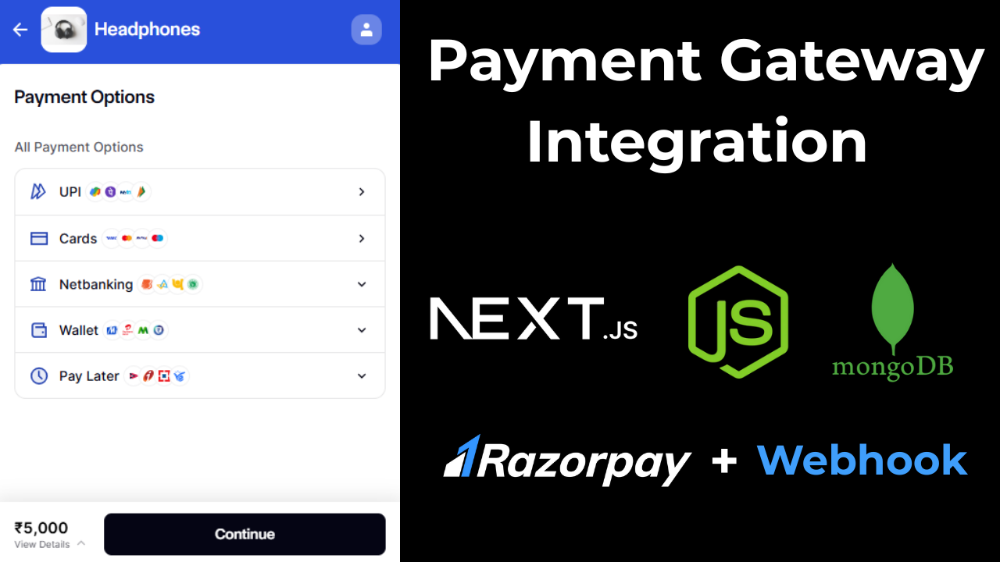
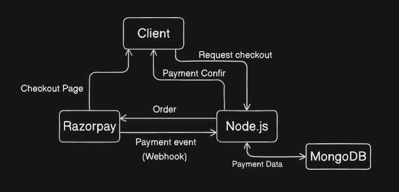
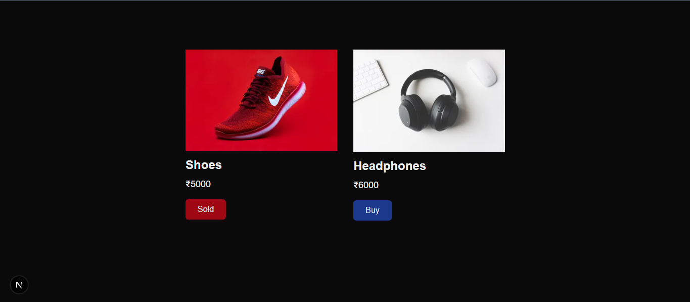
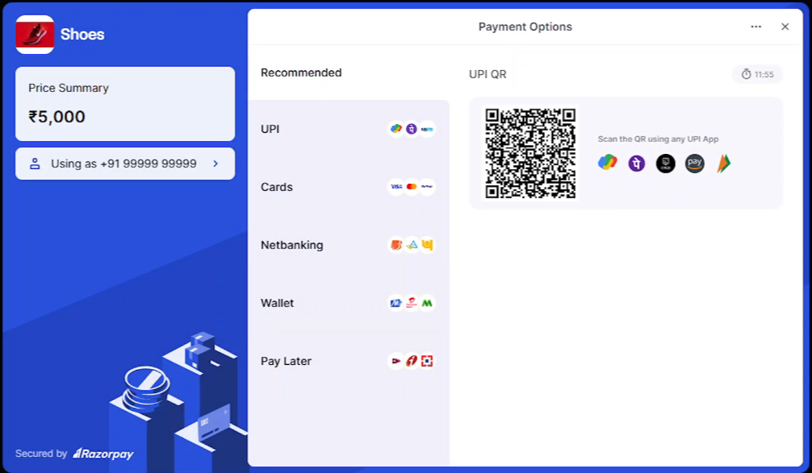
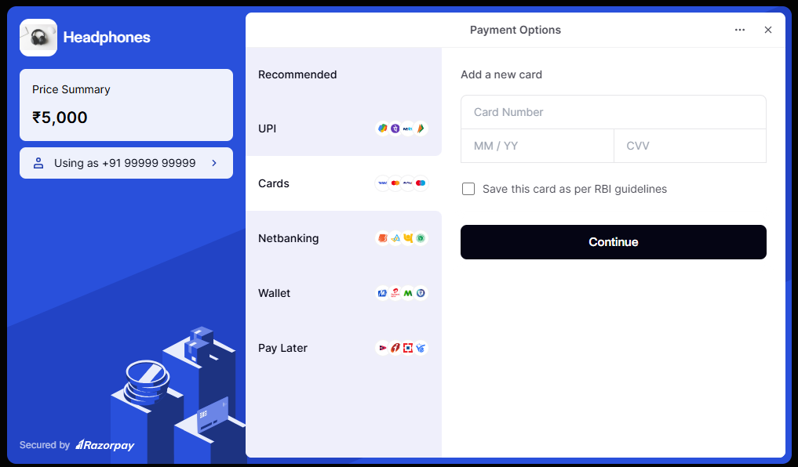
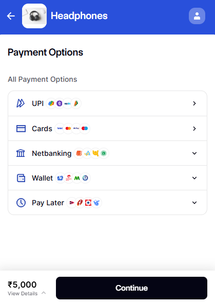

# E Commerce

A full stack e-commerce application where users can securely purchase them using multiple payment options.

## Description

This is a dynamic full-stack E-Commerce platform built using Next.js for the frontend and Node.js with Express.js for the backend. It integrates Razorpay for secure online transactions, supporting UPI, card, and net banking payments. The application features seamless checkout with real-time payment status updates.

## Table of Content

- [Key Feature](#key-feature)
- [Technologies Used](#technologies-used)
- [FlowChart](#flowchart)
- [Prerequisites](#prerequisites)
- [Installation](#installation)
- [Screen Shot](#screenshot)

## Youtube Video

Link: https://youtu.be/7MlvCDbGzB0



### Key Feature

- Product catalog with details and images

- Checkout with Razorpay payment gateway integration (UPI, card, net banking)

- Order placement and payment status tracking

- Secure backend API with Express.js

- Data management with MongoDB

### Technologies Used

**Frontend**: Next.js (React)

**Backend**: Node.js, Express.js

**Database**: MongoDB (Mongoose)

**Payment Gateway**: Razorpay

**Other**: Axios, Tailwind CSS, and REST APIs

## Flowchart



## Prerequisites

Node > v20.10.0\
Npm > v10.8.1

## Installation

**1. Clone the repository:**

```Bash
git clone https://github.com/theadiga27/node-payment.git
cd node-payment
```

**2. Install dependencies:**

1. Backend dependencies

```Bash
npm install
```

2. Frontend dependencies

```
cd client
npm install
```

**3. Change a `.env.example` file to `.env`**

1. Backend `.env` in the root directory
2. Frontend `.env` in the client directory
3. Add Necessary data to the variables.

**4. Run the server**

1. Backend server

```
npm start
```

2. Frontend server

```
cd client
npm run dev
```

## Screenshot






